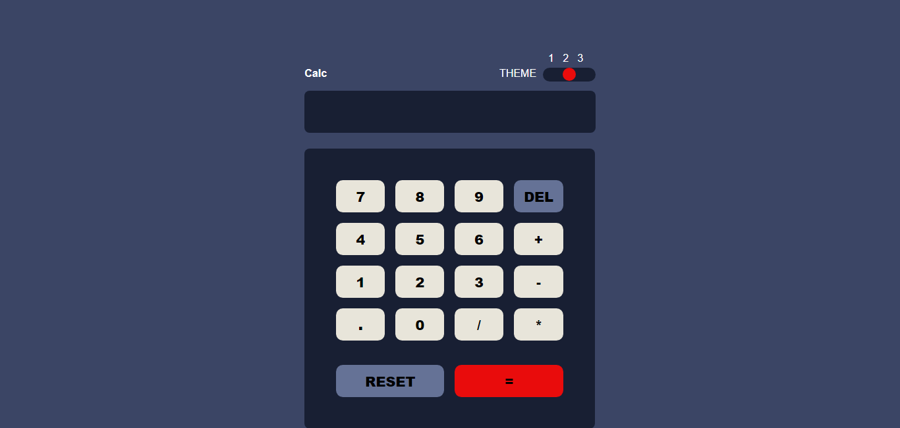

# Circle-24-calculator-assignment-
JavaScript calculator group project 

## Table of content

- [Circle-24-calculator-assignment-](#circle-24-calculator-assignment-)
  - [Table of content](#table-of-content)
  - [Description](#description)
  - [Screenshot](#screenshot)
  - [Links](#links)
  - [Built with](#built-with)
  - [Continued development](#continued-development)
  - [Contributors](#contributors)

## Description

This calculator application is a basis math calculator. And users can:
- Perform mathmatical operations like addition, subtraction, multiplication, and division
- See the size of the elements adjust based on their device's screen size
- See the size of the elements adjust based on their device's screen size (this feature is coming soon)

## Screenshot

## Links

- Solution URL: (https://github.com/Tamma-alt/Circle-24-calculator-assignment-)
- Live site URL: (https://circle-24-calculator-project.netlify.app/)

## Built with
- Semantic HTML5 
- CSS custom properties
- Desktop-first workflow
- Vanilla JavaScript

## Continued development

Some work has to be done on the error that occures when trying to work with floating point numbers. And also the ability to change to a preferred color theme would be added soon. And as a team we will be taking on a course on reponsive mobile development to improve our skills and be more effiecient on mobile-first workflow.

## Contributors
- [Omah](https://github.com/omaah2)
- [Tayo](https://github.com/jaycee-cpu93)
- [Itemearau ThankGod](https://github.com/Tamma-alt)
- [Mishael]https://github.com/mishael-codes
- [Somto](https://github.com/somzynation)
- [Onadokun Oluwafemi](https://github.com/o1-spec)
- [Dada Adedapo](https://github.com/Ddreyy)
- [Aminat](https://github.com/Ameenaminah)
- [Timmy Tunner](https://github.com/Timniel)
- [Jenrola]